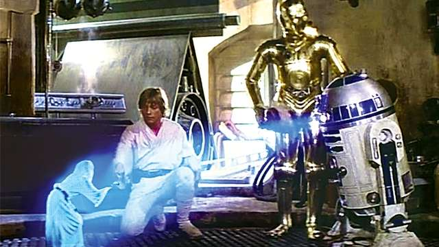

# gear-bus

### Run

Install node v 10+

`npm i npx -g` install npx globally 

`git clone https://github.com/gear-sv/gear-bus` clone from source (docker setup coming soon)

`npm i`

`npm run keys` generates a new keypair

`npm run start` starts bitbus server
